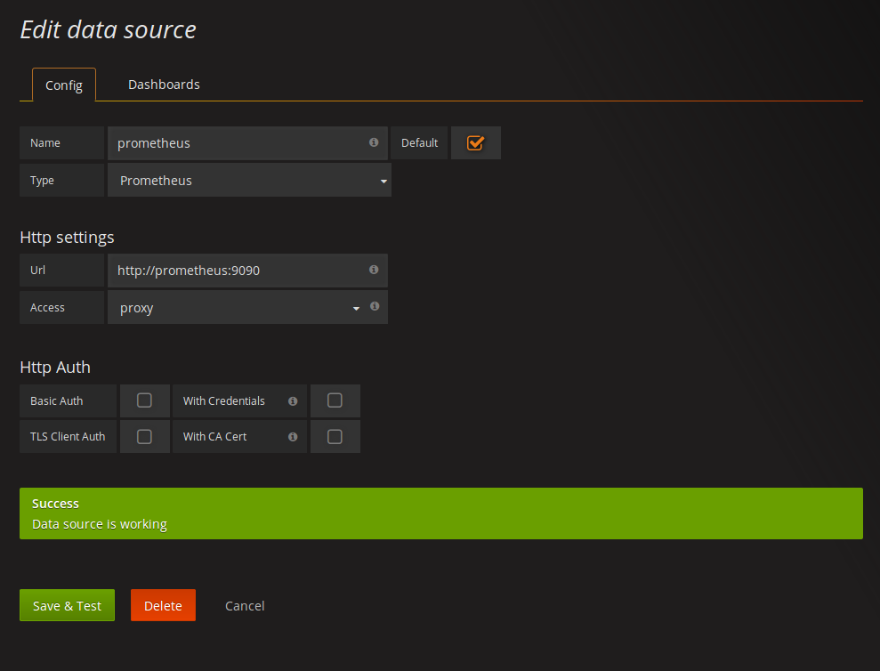
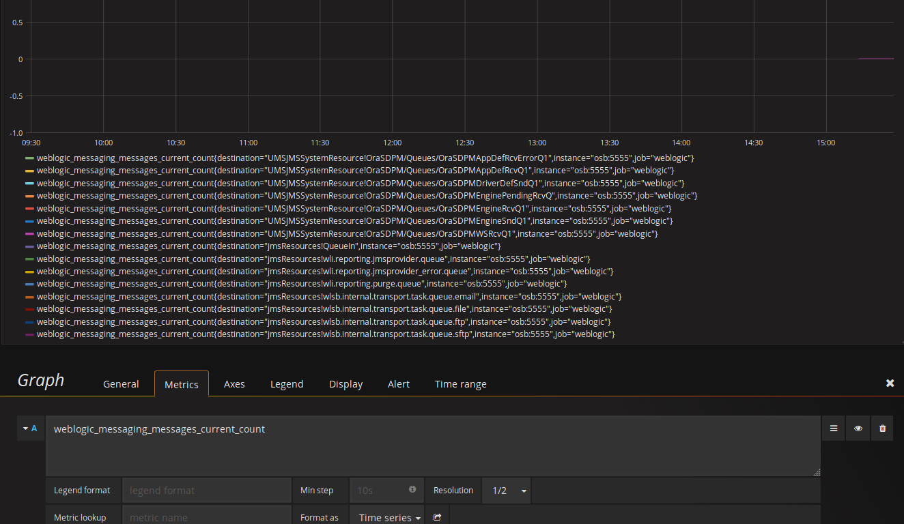
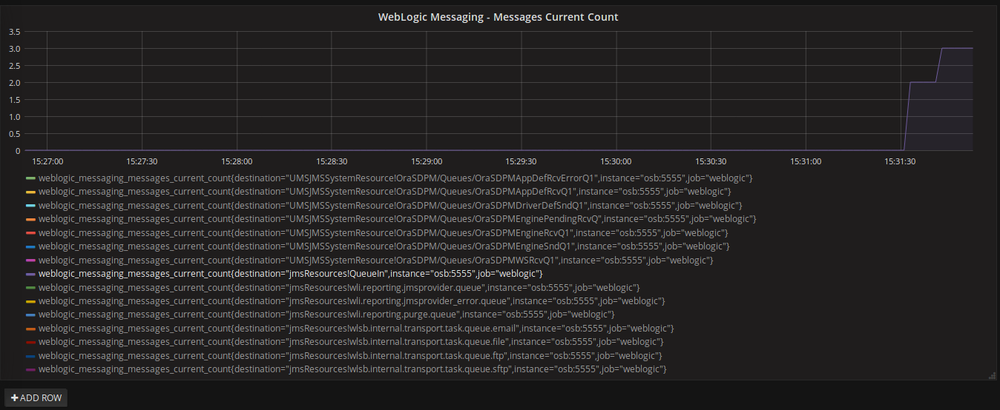

PoC: Monitoring JMS Metrics with Prometheus and Grafana
=======================================================

This Proof of Concept shows how to harvest JMS (and more) metrics from 
Oracle WebLogic JMX, using Prometheus, its JMX exporter and Grafana.

## Current Status

* JMX Exporter working. Solution based on [https://github.com/prometheus/jmx_exporter/issues/109#issuecomment-280000115](https://github.com/prometheus/jmx_exporter/issues/109#issuecomment-280000115)

* Prometheus configured to pull metrics from Exporter

* Manual Grafana configuration

## Requisites 

Oracle SOA Suite 12c Docker image (check here: https://github.com/sysco-middleware/docker-images/)

## How to run it?

### Build Docker Compose 


```bash
$ docker-compose build
Building osb
Step 1/12 : FROM oracle/soa:12.2.1.2-quickstart
 ---> 0411864ad437
Step 2/12 : MAINTAINER ToBeDefined
 ---> Using cache
 ---> 98fc8ad3ebdb
Step 3/12 : COPY container-scripts/createDomain.sh container-scripts/startDomain.sh container-scripts/create-osb-domain.py /u01/oracle/
 ---> Using cache
 ---> 44b6849d46ed
Step 4/12 : USER root
 ---> Using cache
 ---> acf6cf16cdf4
Step 5/12 : RUN chmod +xr /u01/oracle/createDomain.sh &&     chmod +xr /u01/oracle/startDomain.sh &&     chown oracle:oracle -R /u01/oracle/*.sh
 ---> Using cache
 ---> ac1baab4be0d
Step 6/12 : USER oracle
 ---> Using cache
 ---> 5bc200b7545d
Step 7/12 : ENV DOMAIN_NAME "${DOMAIN_NAME:-base_domain}" DOMAIN_HOME /u01/oracle/user_projects/domains/${DOMAIN_NAME:-base_domain} ADMIN_PORT "${ADMIN_PORT:-7001}" PATH "$PATH:${DOMAIN_HOME}"
 ---> Using cache
 ---> c1b5b5c8f836
Step 8/12 : RUN /u01/oracle/createDomain.sh
 ---> Using cache
 ---> f1f00ec348e8
Step 9/12 : WORKDIR ${DOMAIN_HOME}
 ---> Using cache
 ---> 95d2eedebe25
Step 10/12 : COPY config.yml jmx_prometheus_javaagent-0.9.jar ${DOMAIN_HOME}/
 ---> Using cache
 ---> a56f7dccfa9e
Step 11/12 : ENV JAVA_OPTIONS "-javaagent:$DOMAIN_HOME/jmx_prometheus_javaagent-0.9.jar=5555:$DOMAIN_HOME/config.yml"
 ---> Using cache
 ---> c5feccd5c462
Step 12/12 : CMD /u01/oracle/startDomain.sh
 ---> Using cache
 ---> 7393a84d518e
Successfully built 7393a84d518e
prometheus uses an image, skipping
grafana uses an image, skipping
```

This will build an Oracle OSB Domain image with Prometheus JMX exporter agent configured.

### Start Compose

`docker-compose.yml` file includes 3 services:

- Prometheus: Metrics Storage

- Grafana: Monitoring Dashboard

- OSB: OSB server

Before starting Compose, run `prepare-machine.sh` if you are using Docker Machine 
or `prepare-local.sh` if you are using Docker locally.

Then start Compose with `docker-compose up -d`

```bash
$ docker-compose up -d
Creating pocmetricsjms_osb_1
Creating pocmetricsjms_prometheus_1
Creating pocmetricsjms_grafana_1
```

### Check Endpoints

After starting Compose, you can check some endpoints to validate everything is 
up and running: 

- JMX Exporter: [http://$(docker-machine ip):5555/metrics](http://$(docker-machine ip):5555/metrics)

- Prometheus: [http://$(docker-machine ip):9090](http://$(docker-machine ip):9090)

- Grafana: [http://$(docker-machine ip):3000](http://$(docker-machine ip):3000)

### Configure Grafana

* Configure Datasource



* Create Dashboard with Graph 



### Testing

To test the dashboard, start sending messages to one of the queue and see the results
in the dashboard:




## TODO

* Automate Grafana configuration

* Create a more useful Dashboard 